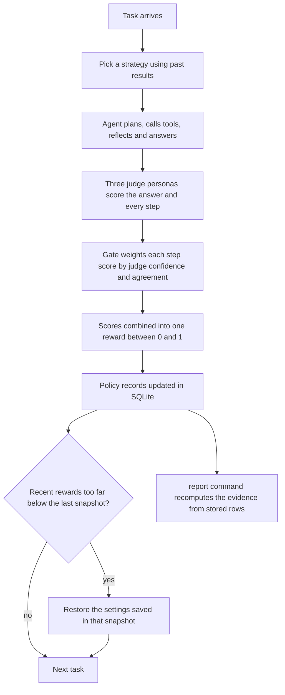
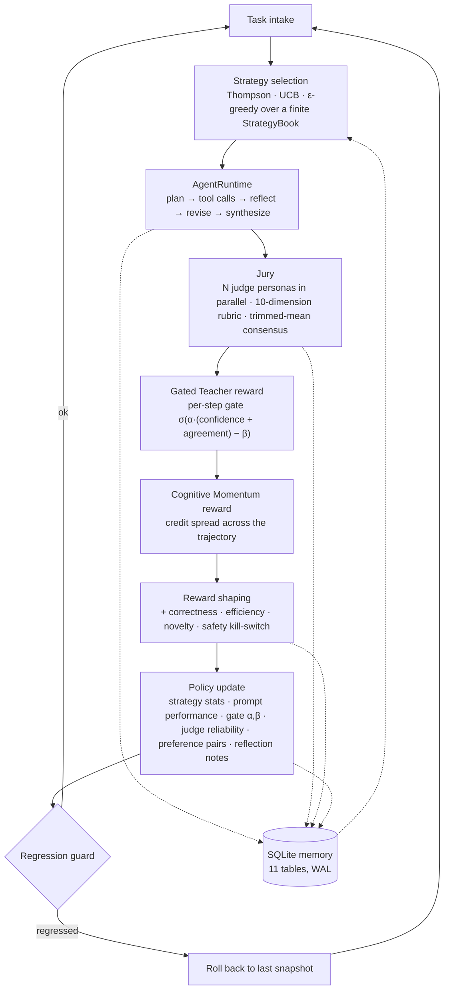

# NOESIS

> **νόησις** *(noun, ancient Greek)* — the act of perception by the intellect.

**A self-improving agent framework that grades its own trajectories with a multi-judge jury, shapes step-level rewards through a learned gate, and updates an inspectable policy across runs. No GPUs, no external services, runs offline.**

  [](https://github.com/gandhiashutosh14/noesis/actions/workflows/ci.yml)  

---

> **In plain English:** Teams that deploy AI (artificial intelligence) agents need to know three things: did a change make the agent better, can the automated judges be trusted, and how can a bad change be undone? NOESIS is a Python framework that runs this improvement loop in the open, with a panel of judges, a database record of every decision, and rollback. It is a working prototype: by default, and in every test and report here, it runs offline on a mock model provider, so no model is called and the scores are deterministic fixtures, not measurements.
>
> **Reading guide:** business readers can read the next three sections, then jump to [SWOT](#swot-analysis) and [where this applies](#where-this-applies). Engineers can go straight to [What it is, and why](#what-it-is-and-why).

## The problem in plain English

*Illustrative example:* a support team runs an AI agent that answers staff questions with the help of a few internal tools. On Monday an engineer rewrites the agent's main instructions, its prompt. By Friday the manager asks a simple question: is the agent better or worse than last week? Nobody can answer with confidence.

This is hard for three reasons. First, an agent works in steps: it plans, calls tools, checks its work and writes an answer. A pass-or-fail mark on the final answer does not say which step helped or hurt. Second, the grading is often done by a large language model (LLM) acting as a judge. LLM judges are fast and cheap, but a single judge can be biased or inconsistent, and its mistakes quietly steer the team. Third, changes pile up. When quality drops, it is hard to tell which change caused it, and the last good set-up may already be gone.

NOESIS makes each part of that loop visible. Three judge personas score every step, and their confidence and agreement decide how much each step score counts. The scores become a reward that gives credit to individual steps, and the loop uses it to update its record of which strategy works for which kind of task. Every decision is kept as a row in SQLite, a single-file database. If recent rewards fall too far below the level saved with the last snapshot, the loop restores the settings saved in that snapshot. A `report` command rebuilds the evidence from the stored rows without calling any model.

The limit matters: in this repository the model is a mock. Its answers and scores are deterministic fixtures, so the committed results show that the machinery works and that the records agree with each other. They do not show that any agent got better.

## Executive summary

| Question | Answer |
|---|---|
| What problem does this address? | Knowing whether a change to an AI agent (a prompt, model or strategy) made it better, whether automated LLM judges can be trusted, and how to roll back a change that made it worse. |
| Who has this problem? | AI platform, product and evaluation teams, and the engineering leaders who approve agent releases, in any organisation that runs LLM agents on repeated tasks. |
| What does this repository do? | Runs an agent on tasks, has three judge personas score each step, turns the scores into a reward, and updates a strategy policy stored in SQLite, with snapshots and rollback. A `report` command recomputes the evidence from the stored rows. |
| What has been shown so far? | 3 automated tests ([`noesis/tests/`](noesis/tests/)) pass offline in GitHub Actions on Python 3.10 and 3.12 ([workflow](.github/workflows/ci.yml)). A committed run of the three example tasks over three cycles stored 9 trajectories and 27 judge scores; 3 of the 9 tool calls recorded an error, no verdict was contested, and the stored reward breakdowns matched the step records ([report](reports/mock-run-2026-09-16.md)). |
| How mature is it? | A working prototype, as [Status and scope](#status-and-scope) says. All committed evidence comes from the mock provider, whose judge scores and rewards are deterministic fixtures, not measurements. |
| What it is not | Not evidence that the agent improves, that the judges are calibrated, or that strategy choice gets better over cycles. Not a benchmark result, and no production use is documented. The OpenAI client is implemented, but no test exercises it. The prompt-mutation code exists, but the loop does not call it yet. |
| What it would take to use it for real | Run the loop and `report` against real models on a task set large enough for reward differences to mean something; compare judge scores with human ratings; set the reward weights and rollback threshold from that data; wire prompt mutation into the loop; add the missing vector store for reflection notes; and connect it to an agent registry as described in [Integrating with an existing agent registry](#integrating-with-an-existing-agent-registry). |

## How it works, end to end

The engineering view of the same loop is in [Architecture](#architecture).



1. **Task intake.** A task has an id, a type such as `arithmetic`, a description and, optionally, an expected answer. Examples live in [`noesis/examples/`](noesis/examples/); the `run-task` and `self-improve` commands are in [`noesis/cli/main.py`](noesis/cli/main.py).
2. **Strategy choice.** The selector picks one of 5 strategies, such as shallow or deep-with-reflection, from past results for that task type. It uses Thompson sampling by default, or UCB (upper confidence bound) or epsilon-greedy ([`noesis/policy/selector.py`](noesis/policy/selector.py)).
3. **Agent run.** The runtime plans, calls tools (a safe calculator, a text search and a sandboxed Python runner), reflects, may revise, and writes an answer. Every step is recorded ([`noesis/runtime/runtime.py`](noesis/runtime/runtime.py)).
4. **Jury.** Three judge personas score the trajectory on 10 rubric dimensions and give each step a score and a confidence. The jury averages them and flags the verdict as contested when the judges disagree too much ([`noesis/judges/jury.py`](noesis/judges/jury.py)).
5. **Reward.** The gate turns each step's judge confidence and agreement into a weight. Cognitive Momentum spreads credit across the steps. Correctness, efficiency and novelty are added, and a safety failure sets the reward to zero ([`noesis/rewards/shaping.py`](noesis/rewards/shaping.py)).
6. **Policy update.** The loop updates strategy statistics, the gate settings, a running Brier score per judge, preference pairs and reflection notes ([`noesis/policy/update.py`](noesis/policy/update.py)).
7. **Regression guard.** If the rolling mean reward drops more than a set threshold below the latest snapshot's level, the loop restores the settings saved in that snapshot: the gate parameters and any active prompt versions. Strategy counts are deliberately left alone ([`noesis/loop/regression.py`](noesis/loop/regression.py)).
8. **Evidence.** `report` reads the SQLite store only, recomputes what happened, and lists any mismatch with what the reward layer stored ([`noesis/report/evidence.py`](noesis/report/evidence.py)).

**Worked example.** Row 1 of the committed mock run ([`reports/mock-run-2026-09-16.md`](reports/mock-run-2026-09-16.md)). The scores are deterministic fixtures from the mock provider, not measurements.

| Stage | What the store recorded |
|---|---|
| Task | `demo_math_001` (`arithmetic`): "What is 47 * 13 + 28?", expected answer 639 ([`task_math.json`](noesis/examples/task_math.json)) |
| Strategy | `baseline_standard` |
| Agent steps | 4 in total: 1 plan, 1 tool call with no error, 2 synthesize steps |
| Jury | 3 judges; mean overall score 0.7656, standard deviation 0.0121, agreement 0.9759, not contested |
| Reward | 0.3577 in total, including 0.1893 from Cognitive Momentum and 0.0817 from the gated teacher |
| Cross-check | 0 thrash steps, and one stored gate per step, both matching the step records |

Agreement is 1 minus the judges' standard deviation divided by 0.5, so near-identical scores give agreement close to 1. In the same run, all 3 tool errors came from the multi-step example, where the mock planner passed the calculator an expression it refuses; those trajectories still completed and were scored.

## What it is, and why

Most "self-improving agent" demos do one of two things: fine-tune weights nobody can inspect, or loop an LLM over its own output and hope. NOESIS does neither.

It runs a task through a plan → tool → reflect → synthesize agent, sends the full trajectory to a **jury of judge personas**, converts their per-step verdicts into a reward through two named reward functions, and then updates a **policy that lives in SQLite**: which strategy to pick next, which prompt version is winning, how much to trust each judge, and how wide to open the gate on noisy teacher signals. Every decision is a row you can query.

The whole loop runs end-to-end on a laptop with a deterministic in-process mock LLM, so the integration of all eight layers is covered by one offline test. Point the routing at OpenAI or Azure OpenAI and the same loop runs against real models.

## Architecture



## Two named contributions

### 1. Cognitive Momentum Reward (CMR)

Most reward functions measure where the trajectory *ended*. CMR measures whether the trajectory demonstrated *productive movement toward truth under uncertainty*. For trajectory τ with steps s₁..sₙ:

```
CM(τ) = Σⱼ σ(αⱼ) · Δhⱼ · κⱼ
        − Σⱼ 𝟙[thrash(sⱼ)] · λ_thrash
        + 𝟙[productive_recovery(τ)] · λ_rec
        + calibration_bonus(τ)
```

| Symbol | Meaning |
|---|---|
| σ(αⱼ) | The gate from contribution #2: strength of step j's teacher signal |
| Δhⱼ | Entropy-reduction proxy at step j (per-step jury consensus × confidence delta) |
| κⱼ | Depth-appropriateness: penalises deep reasoning on trivial steps and shallow reasoning on hard ones |
| thrash(sⱼ) | Step j is a revise/backtrack **not** preceded by a reflect step |
| productive_recovery(τ) | A reflection appeared, and post-reflection consensus rose above the pre-reflection mean |
| calibration_bonus(τ) | Reward when self-reported confidence aligned with jury consensus |

CMR distributes credit *across* the trajectory. That is the credit-assignment problem sparse end-of-episode rewards cannot solve for multi-step agents. Implementation: [`noesis/rewards/cognitive_momentum.py`](noesis/rewards/cognitive_momentum.py).

### 2. Gated Teacher Reward

Inspired by SDAR-style self-distillation, which treats teacher signals as a *gated* auxiliary objective so that noisy teachers cannot destabilise multi-turn training. NOESIS does no gradient training, but the insight maps cleanly onto preference learning over agent trajectories:

```
σ(αⱼ) = sigmoid( α · (judge_confidenceⱼ + inter_judge_agreementⱼ) − β )
```

with hard floors on confidence and agreement (below them the signal is zeroed), and an asymmetric `negative_attenuation` factor that softly down-weights steps the jury scored below the trajectory average. α and β are not learned by backprop: they are stored per experiment in the `gate_params` table and nudged online by a gradient-free rule whose direction is the sign of (realised reward − target reward). Implementation: [`noesis/rewards/gated_teacher.py`](noesis/rewards/gated_teacher.py).

## Key features

- **Multi-judge jury**: three configurable personas (rigorous auditor, frontier researcher, pragmatic engineer), each with its own rubric weights over 10 dimensions, evaluated in parallel, aggregated by trimmed mean, with an inter-judge agreement score and a *contested* flag.
- **Three exploration policies** over a finite strategy book (5 strategies: shallow, standard, deep-with-reflection, search-first, compute-first): Thompson sampling on Beta posteriors, UCB, or ε-greedy.
- **Prompt evolution with rollback**: losing prompt versions get an LLM-proposed mutation conditioned on the jury's most adversarial critique; new versions carry a parent pointer and are promoted only after winning preference pairs.
- **DPO-style preference pairs** formed from reward gaps within a task type, stored for the mutator and the selector to consume.
- **Judge reliability tracking**: a running Brier score per (judge, task type) so calibrated judges earn more weight.
- **Regression guard**: rolling reward mean compared to the last policy snapshot; rollback if it regresses past a threshold.
- **Safe tools**: an AST-walking calculator (no `eval`), an in-process text search, and a sandboxed Python runner that forbids imports, attribute access and dunder names.
- **Typed configuration**: every knob is a Pydantic v2 schema with cross-field validation (routing must reference declared endpoints, reward weights must sum to ~1). Env-var overrides for provider, model, DB path, seed.
- **Deterministic mock LLM** that infers its role from the prompt and emits structurally valid JSON plans, verdicts, reflections and mutations, seeded per endpoint so runs are reproducible.

## Tech stack

Python 3.10+ · asyncio · Pydantic v2 · PyYAML · SQLite (WAL, foreign keys) · optional `openai>=1.0` for real endpoints. About 5,000 lines across 11 packages; no framework dependency.

## AI engineering highlights

The parts that were hard to get right, and how they were solved:

1. **Testing an LLM loop without an LLM.** The entire policy machinery has to be exercisable in CI. The [`MockClient`](noesis/llm/client.py) parses role markers out of the prompt ("You are a planner", "You are a judge"), emits role-appropriate structured JSON, and is seeded from a hash of the endpoint name, so judge scores, preference pairs and gate drift are reproducible fixtures rather than flaky noise.
2. **Step-level credit, not episode-level credit.** Judges return per-step scores with confidence; the gate turns those into per-step weights; CMR consumes the weights. The test asserts that the number of step gates equals the number of trajectory steps, which is the invariant that makes the credit assignment honest.
3. **Online, gradient-free learning of the gate.** α and β cannot be trained by backprop because nothing is differentiable. They are updated by sign of (realised − target) reward with a small learning rate, persisted per experiment, and the test checks they stay inside sane bounds after eight cycles.
4. **Making "improvement" auditable.** Eleven SQLite tables (`tasks`, `trajectories`, `judge_scores`, `rewards`, `preference_pairs`, `strategy_stats`, `prompt_versions`, `reflection_notes`, `gate_params`, `judge_reliability`, `policy_snapshots`) mean any claim the system makes about learning can be checked with a `SELECT`.
5. **Not letting the policy walk off a cliff.** Snapshots plus a deliberately simple regression guard: bootstrap confidence intervals sound better but are unstable at the low sample counts this loop operates at.
6. **Safe code execution for an agent tool** without a container: AST allow-listing of node types and builtins, rejection of imports, attribute access and dunder names.

## Quick start

```bash
git clone https://github.com/gandhiashutosh14/noesis.git
cd noesis
python -m venv .venv
# Windows: .venv\Scripts\activate    macOS/Linux: source .venv/bin/activate
pip install -e ".[dev]"

# 1. Run the tests (offline, mock provider, a few seconds): the closed loop and the report check
pytest -q

# 2. Run a single task through the loop
python -m noesis.cli.main run-task --task-id demo_1 --task-type arithmetic --description "What is 47 * 13 + 28?" --expected-answer 639 --complexity 0.2

# 3. Run the bundled example tasks three times and let the policy update across them
python -m noesis.cli.main self-improve --tasks noesis/examples --cycles 3 --snapshot-every 2

# 4. Inspect what the policy learned
python -m noesis.cli.main show-stats --task-type arithmetic

# 5. Recompute an evidence report from the store (reads SQLite only, calls no model)
python -m noesis.cli.main report --out reports/my-run.md --json reports/my-run.json
```

The CLI writes `noesis_state.db` in the current directory (git-ignored). Delete it to start from a blank policy.

### What a run looks like

Output of step 2 above on the mock provider (Windows 11, Python 3.11, 2026-09-16):

```json
{
  "task_id": "demo_1",
  "strategy_id": "baseline_shallow",
  "final_answer": "Based on the executed trajectory for the task 'What is 47 * 13 + 28?', the resolved answer is: 639.",
  "consensus_overall": 0.7591,
  "contested": false,
  "agreement": 0.9616,
  "reward_final": 0.3411,
  "cognitive_momentum": 0.1726,
  "gated_teacher": 0.0817,
  "guard_triggered": false,
  "snapshot_id": null
}
```

Step 3 (three example tasks × three cycles) ran 9 cycles at a mean reward of 0.315 and left the following behind in SQLite: 9 trajectories, 27 judge scores (3 judges × 9), 9 rewards, 9 reflection notes, 8 strategy-stat rows, 4 policy snapshots, 1 gate-parameter row. Zero preference pairs formed, because the mock's reward gaps stayed under `preference_margin`; see *Status and scope*.

### Evaluation evidence

[`reports/mock-run-2026-09-16.md`](reports/mock-run-2026-09-16.md) is the `report` command run over the store left by step 3 above (three example tasks, three cycles, mock provider). The command reads the `trajectories`, `judge_scores` and `rewards` tables and recomputes, per trajectory, the step kinds, tool calls and tool errors, thrash steps (a revise not preceded by a reflect), repeated revisions of the same step, the mean and spread of the judges' overall scores, the agreement and contested flag, and, per judge, how far it sits from the jury mean. It then compares the recomputation with what the reward layer stored (thrash step ids, number of step gates) and lists any discrepancy.

One thing the run shows that the summary numbers hide: 3 of the 9 tool calls recorded an error, all three from the multi-step example, where the mock planner hands the calculator an expression the AST evaluator refuses (`SyntaxError`). The runtime records the error on the step, the trajectory still completes, and the judges score it anyway; a report over a real-model store would show whether that pattern persists. No trajectory in this run had a thrash step or a contested verdict.

What it proves: the layers are wired and the stored reward breakdowns agree with the step records. What it does not prove: anything about task quality, judge calibration or improvement over cycles. Under the mock provider the judge scores are deterministic fixtures; the report header names the model recorded in the steps so that this is visible in the artifact itself, and the same command over a store produced with a real model would be the place to look for real behaviour. A test builds a small store with the mock and checks the report against the rows.

### Using a real model

Edit `noesis/config/defaults.yaml` so the `routing` primaries point at `openai_4o_mini` or `openai_4o` and export `OPENAI_API_KEY`, or override without editing:

```bash
pip install -e ".[openai]"
export NOESIS_LLM_PROVIDER=openai NOESIS_LLM_MODEL_ID=gpt-4o-mini OPENAI_API_KEY=sk-...
python -m noesis.cli.main self-improve --tasks noesis/examples
```

Azure OpenAI works through the same client by setting `base_url` on the endpoint.

## Project layout

```
noesis/
├── config/        schema.py (Pydantic v2), defaults.yaml (mock provider), loader.py (env overrides)
├── memory/        store.py — SQLite store, 11 tables, WAL
├── llm/           client.py — BaseLLMClient, OpenAIClient, MockClient, LLMRouter with fallback chains
├── tools/         calculator (AST), text_search (in-process), code_runner (sandboxed) + ToolRegistry
├── runtime/       state.py, action.py, runtime.py — plan → execute → reflect → synthesize
├── judges/        rubric.py (10 dimensions), jury.py (parallel judges, trimmed-mean consensus)
├── rewards/       cognitive_momentum.py, gated_teacher.py, components.py, shaping.py
├── policy/        strategy_book.py, selector.py, preference_store.py, prompt_evolution.py, update.py
├── loop/          self_improve.py (orchestrator), regression.py (snapshot + rollback guard)
├── report/        evidence.py — the report recomputed from the store
├── cli/           main.py — run-task / self-improve / show-stats / report
├── examples/      three task JSONs (arithmetic, knowledge lookup, multi-step)
└── tests/         test_e2e.py — the closed loop, offline; test_report.py — report vs store
reports/                   the committed evidence report of a mock-provider run
docs/DEVELOPMENT_NOTES.md  how this project was built and refined
```

## Status and scope

This is a **working prototype**, not a benchmarked research result.

- The e2e test proves the eight layers are wired and the invariants hold. It does **not** prove that the policy improves task quality: under the mock provider, reward numbers are deterministic fixtures, not measurements.
- The OpenAI client is implemented but not exercised by the test suite. Anthropic is a declared provider with a `NotImplementedError` stub.
- Preference pairs need a reward gap above `preference_margin`; the mock can produce ties, so the test requires the query to succeed rather than requiring pairs to exist.
- Vector recall for reflection notes is an off-by-default flag with no vector store shipped; text-keyed retrieval is what runs.
- Cross-task-type generalisation of preference pairs is a natural extension and is not implemented.

## Integrating with an existing agent registry

NOESIS decides *which strategy to use when calling* a capability; an agent registry decides *which agent to call*. They compose: register a `ToolHandle` whose `fn` calls your registry's orchestrate endpoint, list it in a strategy's `tool_preference`, and CMR will reward trajectories where the registry's routing produced productive momentum. The adapter is deliberately not shipped so the package stays decoupled from any specific registry API.

## SWOT analysis

A SWOT analysis lists **S**trengths and **W**eaknesses (inside the project) and **O**pportunities and **T**hreats (outside it).

| | Helpful | Harmful |
|---|---|---|
| **Internal** | **Strengths**<br>• Every choice, score and reward is a SQLite row, so any claim about learning can be checked with a query<br>• Step-level credit: judges score each step, and a gate weights those scores by confidence and agreement<br>• The loop runs offline in a few seconds on a deterministic mock, so continuous integration (CI) needs no keys or network<br>• An evidence report recomputes results from the stored rows and lists any mismatch<br>• Safer tools: a calculator that parses expressions instead of calling `eval`, and a sandboxed Python runner | **Weaknesses**<br>• All committed evidence comes from a mock provider; its scores are deterministic fixtures, not measurements<br>• No evidence yet that the agent, the judges or strategy choice improve over cycles<br>• A small evidence base: three example tasks and 9 trajectories in the committed run, with 0 preference pairs formed<br>• Prompt mutation is written ([`prompt_evolution.py`](noesis/policy/prompt_evolution.py)) but not yet called by the loop; the committed run stored 0 prompt versions<br>• The three default judges share one model endpoint, and with three judges the trimmed mean trims nothing, so one outlier still moves the consensus<br>• The OpenAI client is not exercised by the tests; reward weights and thresholds are set by hand; vector recall and cross-task preference pairs are not implemented |
| **External** | **Opportunities**<br>• Teams that deploy agents need release checks and an audit trail for every agent change<br>• Research on panels of LLM judges supports the jury design (see [Further reading](#further-reading))<br>• Could sit beside an existing agent registry as a strategy-selection layer<br>• The stored preference pairs and critiques could later feed preference-based model training | **Threats**<br>• Hosted evaluation and observability platforms already offer LLM-as-judge scoring and experiment tracking<br>• Known LLM-judge biases, such as favouring longer answers, can leak into rewards unless people spot-check them<br>• Hosted model services and their prices change often, which can break or reprice a loop that makes several model calls per task<br>• Emerging rules on AI transparency may ask for more record-keeping than this prototype provides |

**Bottom line.** NOESIS is a well-instrumented harness for an agent-improvement loop. Its value today is transparency: every decision can be inspected and re-checked from the stored rows. Whether the loop improves a real agent has not been tested yet, and that is the next thing to measure.

## Where this applies

The rows below are illustrative fits for the approach; none describes a documented deployment.

| Industry | Example use case | What this project's approach contributes |
|---|---|---|
| Customer support | An agent that drafts replies using a knowledge-base search | Step scores show whether the search step or the writing step caused a weak reply; rollback limits the damage of a bad change |
| Software engineering | An agent that writes, runs and revises small programs | A sandboxed code-runner pattern, and thrash detection that flags revising without reflecting first |
| Financial services | An agent that computes figures from company reports for analysts | An auditor-style judge persona, a safety check that zeroes the reward, and a queryable record for reviewers |
| Healthcare administration | An agent that answers billing-policy questions from internal documents | A contested flag that marks answers the judges disagree on, which a team could route to a person |
| Legal and compliance | An agent that checks documents against a checklist | Stored judge critiques and reflection notes that explain why an answer scored low |
| Education | A tutoring agent that explains maths step by step | Step-level credit that rewards sound intermediate reasoning, not only the final number |
| AI platform teams | Choosing between strategies or model routes for an internal agent | Bandit-based strategy selection, preference pairs and snapshots, all inspectable in SQLite |
| Evaluation research | Measuring how far LLM judges agree with each other | A report that recomputes agreement and each judge's distance from the jury mean |

## Glossary

| Term | Plain-English meaning |
|---|---|
| Agent | A program that uses a language model to plan, call tools and produce an answer over several steps. |
| Trajectory | The full record of one agent run: every step, every tool call and the final answer. |
| Judge persona and jury | A judge persona is an LLM prompted to grade from a set point of view; the jury is three of them, with their scores combined. |
| Rubric | The 10 dimensions each judge scores, such as correctness, faithfulness and safety. |
| Trimmed mean | An average that drops the most extreme values first, so a single outlier counts for less. |
| Contested verdict | A result where the judges' scores are spread out beyond a set threshold. |
| Reward | One number between 0 and 1 that sums up how good a trajectory was; the policy learns from it. |
| Cognitive Momentum Reward (CMR) | This project's step-level reward: it spreads credit across steps and penalises revising without reflecting first. |
| Gated teacher reward | This project's reward that lets a judge's step score count only as much as the judges' confidence and agreement allow. |
| Thompson sampling, UCB and epsilon-greedy | Three standard "multi-armed bandit" methods for balancing untried strategies against the best one so far. |
| Preference pair | Two trajectories of the same task type where one earned a clearly higher reward, stored as "this beat that". |
| Brier score | The average squared gap between a forecast and the outcome; lower means a better-calibrated judge. |
| Snapshot and rollback | A saved copy of key settings, and putting it back when recent rewards drop too far. |
| Mock provider | A built-in stand-in for a real model that returns fixed, well-formed answers, so the loop runs without network access or keys. |

## Further reading

Background on the ideas NOESIS combines, from step-level feedback and LLM judges to bandit methods.

| Resource | What it is | Why it matters here |
|---|---|---|
| [Let's Verify Step by Step](https://arxiv.org/abs/2305.20050) — Lightman et al., 2023 | Compares feedback on each reasoning step with feedback on the final answer only, when training models on maths problems. | It found step-level feedback worked better, which is the idea behind scoring every step here. |
| [Judging LLM-as-a-Judge with MT-Bench and Chatbot Arena](https://arxiv.org/abs/2306.05685) — Zheng et al., 2023 | Tests strong LLMs as judges against human preferences, and documents biases such as favouring an answer for its position or its length. | Explains why LLM judges are useful, and why NOESIS tracks judge agreement and reliability. |
| [Replacing Judges with Juries: Evaluating LLM Generations with a Panel of Diverse Models](https://arxiv.org/abs/2404.18796) — Verga et al., 2024 | Finds that a panel of smaller judge models from different model families can beat a single large judge, with less bias. | The research case for a jury; its results also favour giving the personas different models instead of one shared endpoint. |
| [A Tutorial on Thompson Sampling](https://arxiv.org/abs/1707.02038) — Russo et al., 2017 | A tutorial on a method that balances using what is known against trying options that might be better. | Thompson sampling is the default strategy selector in NOESIS. |
| [Finite-time Analysis of the Multiarmed Bandit Problem](https://doi.org/10.1023/A:1013689704352) — Auer, Cesa-Bianchi and Fischer, 2002 | The paper behind the widely used UCB1 rule, with guarantees that hold after any number of trials. | The UCB selector in NOESIS uses this style of mean-plus-bonus score. |
| [Reinforcement Learning: An Introduction](http://incompleteideas.net/book/the-book-2nd.html) — Sutton and Barto, second edition, 2018 | A widely used reinforcement-learning textbook; the book's page links a free full text. | Covers bandits, epsilon-greedy, rewards and credit assignment, the building blocks used here. |
| [Direct Preference Optimization: Your Language Model is Secretly a Reward Model](https://arxiv.org/abs/2305.18290) — Rafailov et al., 2023 | Trains a language model directly from pairs of preferred and rejected answers, without a separate reward model. | NOESIS stores preference pairs of the kind direct preference optimization (DPO) uses; the paper shows how such pairs can train a model. |
| [Reflexion: Language Agents with Verbal Reinforcement Learning](https://arxiv.org/abs/2303.11366) — Shinn et al., 2023 | Agents write reflections on feedback and keep them in memory to do better on later attempts, without changing model weights. | NOESIS stores reflection notes drawn from judge critiques in a similar spirit. |
| [Brier score](https://en.wikipedia.org/wiki/Brier_score) — Wikipedia | An explainer of a common score for checking probability forecasts. | NOESIS keeps a running Brier score for each judge to track how reliable it is. |
| [Multi-armed bandit](https://en.wikipedia.org/wiki/Multi-armed_bandit) — Wikipedia | An explainer of repeatedly choosing among options whose payoffs are unknown. | Plain-English background for how NOESIS picks a strategy for each task. |

## License

MIT. See [LICENSE](LICENSE).
