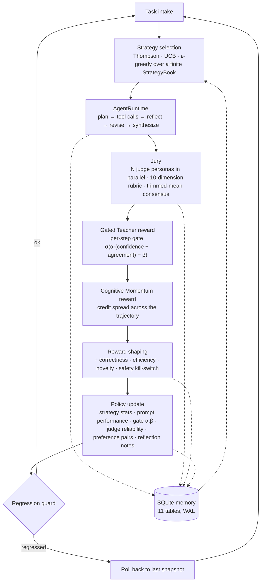

# NOESIS

> **νόησις** *(noun, ancient Greek)* — the act of perception by the intellect.

**A self-improving agent framework that grades its own trajectories with a multi-judge jury, shapes step-level rewards through a learned gate, and updates an inspectable policy across runs. No GPUs, no external services, runs offline.**

  [](https://github.com/gandhiashutosh14/noesis/actions/workflows/ci.yml)  

---

## What it is, and why

Most "self-improving agent" demos do one of two things: fine-tune weights nobody can inspect, or loop an LLM over its own output and hope. NOESIS does neither.

It runs a task through a plan → tool → reflect → synthesize agent, sends the full trajectory to a **jury of judge personas**, converts their per-step verdicts into a reward through two named reward functions, and then updates a **policy that lives in SQLite**: which strategy to pick next, which prompt version is winning, how much to trust each judge, and how wide to open the gate on noisy teacher signals. Every decision is a row you can query.

The whole loop runs end-to-end on a laptop with a deterministic in-process mock LLM, so the integration of all eight layers is covered by one offline test. Point the routing at OpenAI or Azure OpenAI and the same loop runs against real models.

## Architecture



## Two named contributions

### 1. Cognitive Momentum Reward (CMR)

Most reward functions measure where the trajectory *ended*. CMR measures whether the trajectory demonstrated *productive movement toward truth under uncertainty*. For trajectory τ with steps s₁..sₙ:

```
CM(τ) = Σⱼ σ(αⱼ) · Δhⱼ · κⱼ
        − Σⱼ 𝟙[thrash(sⱼ)] · λ_thrash
        + 𝟙[productive_recovery(τ)] · λ_rec
        + calibration_bonus(τ)
```

| Symbol | Meaning |
|---|---|
| σ(αⱼ) | The gate from contribution #2: strength of step j's teacher signal |
| Δhⱼ | Entropy-reduction proxy at step j (per-step jury consensus × confidence delta) |
| κⱼ | Depth-appropriateness: penalises deep reasoning on trivial steps and shallow reasoning on hard ones |
| thrash(sⱼ) | Step j is a revise/backtrack **not** preceded by a reflect step |
| productive_recovery(τ) | A reflection appeared, and post-reflection consensus rose above the pre-reflection mean |
| calibration_bonus(τ) | Reward when self-reported confidence aligned with jury consensus |

CMR distributes credit *across* the trajectory. That is the credit-assignment problem sparse end-of-episode rewards cannot solve for multi-step agents. Implementation: [`noesis/rewards/cognitive_momentum.py`](noesis/rewards/cognitive_momentum.py).

### 2. Gated Teacher Reward

Inspired by SDAR-style self-distillation, which treats teacher signals as a *gated* auxiliary objective so that noisy teachers cannot destabilise multi-turn training. NOESIS does no gradient training, but the insight maps cleanly onto preference learning over agent trajectories:

```
σ(αⱼ) = sigmoid( α · (judge_confidenceⱼ + inter_judge_agreementⱼ) − β )
```

with hard floors on confidence and agreement (below them the signal is zeroed), and an asymmetric `negative_attenuation` factor that softly down-weights steps the jury scored below the trajectory average. α and β are not learned by backprop: they are stored per experiment in the `gate_params` table and nudged online by a gradient-free rule whose direction is the sign of (realised reward − target reward). Implementation: [`noesis/rewards/gated_teacher.py`](noesis/rewards/gated_teacher.py).

## Key features

- **Multi-judge jury**: three configurable personas (rigorous auditor, frontier researcher, pragmatic engineer), each with its own rubric weights over 10 dimensions, evaluated in parallel, aggregated by trimmed mean, with an inter-judge agreement score and a *contested* flag.
- **Three exploration policies** over a finite strategy book (5 strategies: shallow, standard, deep-with-reflection, search-first, compute-first): Thompson sampling on Beta posteriors, UCB, or ε-greedy.
- **Prompt evolution with rollback**: losing prompt versions get an LLM-proposed mutation conditioned on the jury's most adversarial critique; new versions carry a parent pointer and are promoted only after winning preference pairs.
- **DPO-style preference pairs** formed from reward gaps within a task type, stored for the mutator and the selector to consume.
- **Judge reliability tracking**: a running Brier score per (judge, task type) so calibrated judges earn more weight.
- **Regression guard**: rolling reward mean compared to the last policy snapshot; rollback if it regresses past a threshold.
- **Safe tools**: an AST-walking calculator (no `eval`), an in-process text search, and a sandboxed Python runner that forbids imports, attribute access and dunder names.
- **Typed configuration**: every knob is a Pydantic v2 schema with cross-field validation (routing must reference declared endpoints, reward weights must sum to ~1). Env-var overrides for provider, model, DB path, seed.
- **Deterministic mock LLM** that infers its role from the prompt and emits structurally valid JSON plans, verdicts, reflections and mutations, seeded per endpoint so runs are reproducible.

## Tech stack

Python 3.10+ · asyncio · Pydantic v2 · PyYAML · SQLite (WAL, foreign keys) · optional `openai>=1.0` for real endpoints. About 5,000 lines across 11 packages; no framework dependency.

## AI engineering highlights

The parts that were hard to get right, and how they were solved:

1. **Testing an LLM loop without an LLM.** The entire policy machinery has to be exercisable in CI. The [`MockClient`](noesis/llm/client.py) parses role markers out of the prompt ("You are a planner", "You are a judge"), emits role-appropriate structured JSON, and is seeded from a hash of the endpoint name, so judge scores, preference pairs and gate drift are reproducible fixtures rather than flaky noise.
2. **Step-level credit, not episode-level credit.** Judges return per-step scores with confidence; the gate turns those into per-step weights; CMR consumes the weights. The test asserts that the number of step gates equals the number of trajectory steps, which is the invariant that makes the credit assignment honest.
3. **Online, gradient-free learning of the gate.** α and β cannot be trained by backprop because nothing is differentiable. They are updated by sign of (realised − target) reward with a small learning rate, persisted per experiment, and the test checks they stay inside sane bounds after eight cycles.
4. **Making "improvement" auditable.** Eleven SQLite tables (`tasks`, `trajectories`, `judge_scores`, `rewards`, `preference_pairs`, `strategy_stats`, `prompt_versions`, `reflection_notes`, `gate_params`, `judge_reliability`, `policy_snapshots`) mean any claim the system makes about learning can be checked with a `SELECT`.
5. **Not letting the policy walk off a cliff.** Snapshots plus a deliberately simple regression guard: bootstrap confidence intervals sound better but are unstable at the low sample counts this loop operates at.
6. **Safe code execution for an agent tool** without a container: AST allow-listing of node types and builtins, rejection of imports, attribute access and dunder names.

## Quick start

```bash
git clone https://github.com/gandhiashutosh14/noesis.git
cd noesis
python -m venv .venv
# Windows: .venv\Scripts\activate    macOS/Linux: source .venv/bin/activate
pip install -e ".[dev]"

# 1. Run the tests (offline, mock provider, a few seconds): the closed loop and the report check
pytest -q

# 2. Run a single task through the loop
python -m noesis.cli.main run-task --task-id demo_1 --task-type arithmetic --description "What is 47 * 13 + 28?" --expected-answer 639 --complexity 0.2

# 3. Run the bundled example tasks three times and let the policy update across them
python -m noesis.cli.main self-improve --tasks noesis/examples --cycles 3 --snapshot-every 2

# 4. Inspect what the policy learned
python -m noesis.cli.main show-stats --task-type arithmetic

# 5. Recompute an evidence report from the store (reads SQLite only, calls no model)
python -m noesis.cli.main report --out reports/my-run.md --json reports/my-run.json
```

The CLI writes `noesis_state.db` in the current directory (git-ignored). Delete it to start from a blank policy.

### What a run looks like

Output of step 2 above on the mock provider (Windows 11, Python 3.11, 2026-09-16):

```json
{
  "task_id": "demo_1",
  "strategy_id": "baseline_shallow",
  "final_answer": "Based on the executed trajectory for the task 'What is 47 * 13 + 28?', the resolved answer is: 639.",
  "consensus_overall": 0.7591,
  "contested": false,
  "agreement": 0.9616,
  "reward_final": 0.3411,
  "cognitive_momentum": 0.1726,
  "gated_teacher": 0.0817,
  "guard_triggered": false,
  "snapshot_id": null
}
```

Step 3 (three example tasks × three cycles) ran 9 cycles at a mean reward of 0.315 and left the following behind in SQLite: 9 trajectories, 27 judge scores (3 judges × 9), 9 rewards, 9 reflection notes, 8 strategy-stat rows, 4 policy snapshots, 1 gate-parameter row. Zero preference pairs formed, because the mock's reward gaps stayed under `preference_margin`; see *Status and scope*.

### Evaluation evidence

[`reports/mock-run-2026-09-16.md`](reports/mock-run-2026-09-16.md) is the `report` command run over the store left by step 3 above (three example tasks, three cycles, mock provider). The command reads the `trajectories`, `judge_scores` and `rewards` tables and recomputes, per trajectory, the step kinds, tool calls and tool errors, thrash steps (a revise not preceded by a reflect), repeated revisions of the same step, the mean and spread of the judges' overall scores, the agreement and contested flag, and, per judge, how far it sits from the jury mean. It then compares the recomputation with what the reward layer stored (thrash step ids, number of step gates) and lists any discrepancy.

What it proves: the layers are wired and the stored reward breakdowns agree with the step records. What it does not prove: anything about task quality, judge calibration or improvement over cycles. Under the mock provider the judge scores are deterministic fixtures; the report header names the model recorded in the steps so that this is visible in the artifact itself, and the same command over a store produced with a real model would be the place to look for real behaviour. A test builds a small store with the mock and checks the report against the rows.

### Using a real model

Edit `noesis/config/defaults.yaml` so the `routing` primaries point at `openai_4o_mini` or `openai_4o` and export `OPENAI_API_KEY`, or override without editing:

```bash
pip install -e ".[openai]"
export NOESIS_LLM_PROVIDER=openai NOESIS_LLM_MODEL_ID=gpt-4o-mini OPENAI_API_KEY=sk-...
python -m noesis.cli.main self-improve --tasks noesis/examples
```

Azure OpenAI works through the same client by setting `base_url` on the endpoint.

## Project layout

```
noesis/
├── config/        schema.py (Pydantic v2), defaults.yaml (mock provider), loader.py (env overrides)
├── memory/        store.py — SQLite store, 11 tables, WAL
├── llm/           client.py — BaseLLMClient, OpenAIClient, MockClient, LLMRouter with fallback chains
├── tools/         calculator (AST), text_search (in-process), code_runner (sandboxed) + ToolRegistry
├── runtime/       state.py, action.py, runtime.py — plan → execute → reflect → synthesize
├── judges/        rubric.py (10 dimensions), jury.py (parallel judges, trimmed-mean consensus)
├── rewards/       cognitive_momentum.py, gated_teacher.py, components.py, shaping.py
├── policy/        strategy_book.py, selector.py, preference_store.py, prompt_evolution.py, update.py
├── loop/          self_improve.py (orchestrator), regression.py (snapshot + rollback guard)
├── report/        evidence.py — the report recomputed from the store
├── cli/           main.py — run-task / self-improve / show-stats / report
├── examples/      three task JSONs (arithmetic, knowledge lookup, multi-step)
└── tests/         test_e2e.py — the closed loop, offline; test_report.py — report vs store
reports/                   the committed evidence report of a mock-provider run
docs/DEVELOPMENT_NOTES.md  how this project was built and refined
```

## Status and scope

This is a **working prototype**, not a benchmarked research result.

- The e2e test proves the eight layers are wired and the invariants hold. It does **not** prove that the policy improves task quality: under the mock provider, reward numbers are deterministic fixtures, not measurements.
- The OpenAI client is implemented but not exercised by the test suite. Anthropic is a declared provider with a `NotImplementedError` stub.
- Preference pairs need a reward gap above `preference_margin`; the mock can produce ties, so the test requires the query to succeed rather than requiring pairs to exist.
- Vector recall for reflection notes is an off-by-default flag with no vector store shipped; text-keyed retrieval is what runs.
- Cross-task-type generalisation of preference pairs is a natural extension and is not implemented.

## Integrating with an existing agent registry

NOESIS decides *which strategy to use when calling* a capability; an agent registry decides *which agent to call*. They compose: register a `ToolHandle` whose `fn` calls your registry's orchestrate endpoint, list it in a strategy's `tool_preference`, and CMR will reward trajectories where the registry's routing produced productive momentum. The adapter is deliberately not shipped so the package stays decoupled from any specific registry API.

## License

MIT. See [LICENSE](LICENSE).
